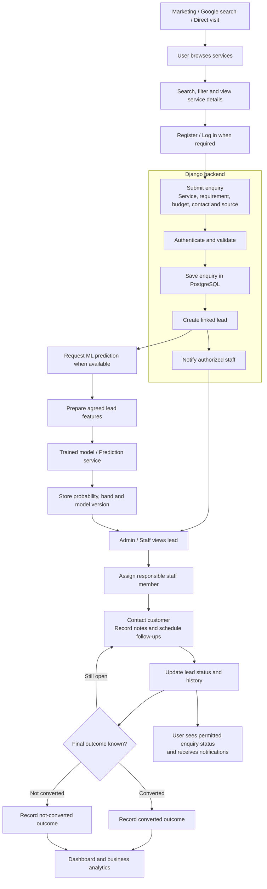
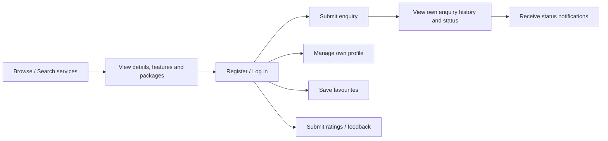
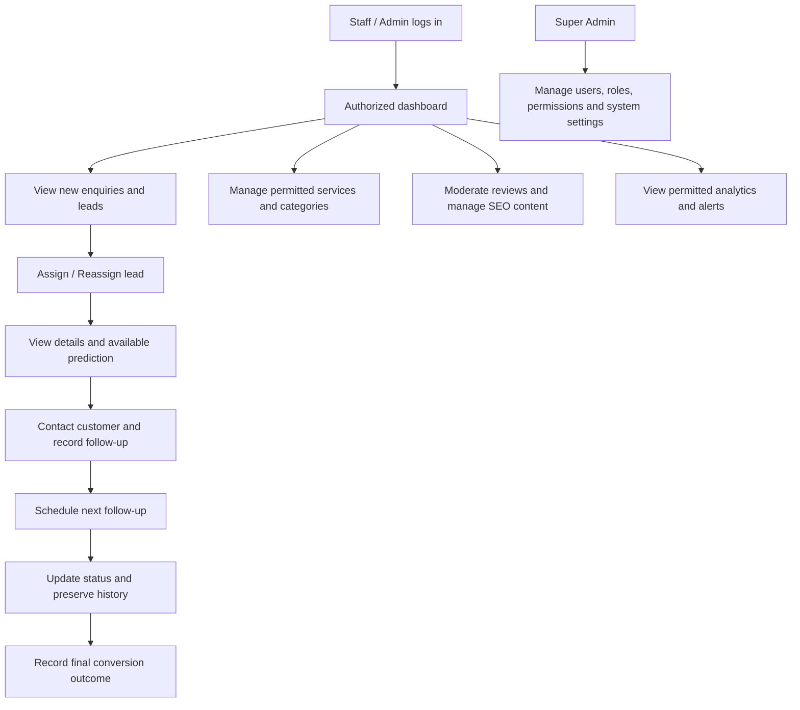
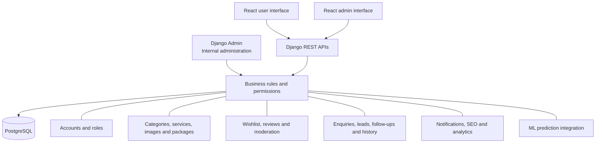
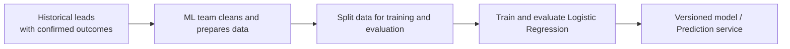
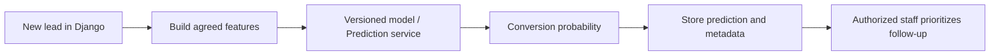
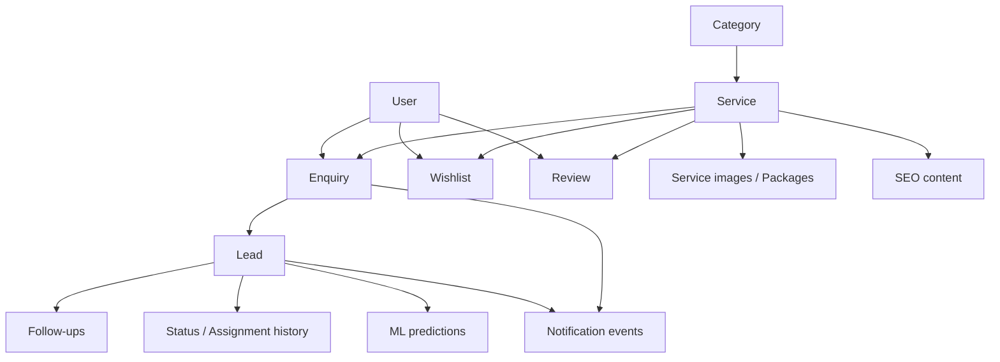

# SMARTLEAD Project Flow and Backend Plan

Prepared: 2 October 2026

Source: `C:/Users/HP/Downloads/SmartLead_Project_Report.pdf`.

This document describes the intended final project flow understood from the report. It is a planning document, not a claim that all features are already implemented. Diagrams use Mermaid and can be viewed in a Markdown viewer that supports Mermaid.

## 1. Project purpose

SMARTLEAD is a digital service discovery and lead management platform. A user discovers a service, submits an enquiry, and the organization manages that enquiry as a lead. Staff record follow-ups and actual outcomes; machine learning estimates conversion probability to help prioritize work.

```text
Service Discovery -> Enquiry -> Lead -> Follow-up -> Conversion Outcome
```

Shopping cart, checkout, payments, shipping, inventory, and order fulfilment are outside the initial scope.

## 2. Main business flow



Implementation proposal: save the enquiry and its linked lead in one database transaction. Deliver notifications after the transaction commits. An unavailable prediction service must not prevent a valid enquiry from being stored.

Whether anonymous enquiry submission is allowed, when prediction is triggered, and how enquiries map to leads must be agreed before implementation.

## 3. User journey



The user must only access their own private profile, enquiries, wishlist, and notifications. Public review visibility follows the agreed moderation policy. Internal staff notes and predictions should only be exposed under the agreed role policy.

## 4. Administrative journey



Staff/admin access is operational. Super-admin access includes system-wide administration. Exact assignment, visibility, and role-management permissions require agreement and server-side enforcement.

## 5. System architecture and responsibility



React consumes Django APIs rather than connecting directly to PostgreSQL or the model. Django owns validation, authorization, business operations, persistence, and the prediction integration interface. Django Admin supports internal administration and does not replace React-facing REST APIs.

| Team | Responsibility |
|---|---|
| Django backend | Models, migrations, PostgreSQL integration, APIs, permissions, business rules, notifications, reports, admin and prediction integration |
| React | User/admin screens, routing, forms, API consumption and agreed engagement-data collection |
| ML | Dataset preparation, model training/evaluation, preprocessing contract and versioned prediction capability |
| Marketing | Keywords, SEO content, source/campaign definitions and content strategy |
| UI/UX and HTML/Tailwind | Approved interface designs and responsive templates |
| Database / QA | Coordinate schema/data management and verify the integrated application with the development teams |

## 6. ML training and prediction are separate flows

### Training flow



### Prediction flow



Potential inputs in the report include traffic source, pages viewed, previous enquiries, time on website, selected service, budget, and engagement score. Field definitions, units, availability and preprocessing must match the trained model.

Actual outcome labels are `converted = 1` and `not converted = 0`. Open/unresolved leads must not automatically be labelled as failures. Only features available at prediction time should be used; later status changes and outcomes are not valid inputs for an initial prediction.

The PDF supplies example values, not a training dataset. The selected Kaggle X Education lead-scoring dataset is a candidate for the initial demonstration; its download/import has not completed. Its field meanings and usage terms need inspection before use. A demonstration model trained on education leads does not establish accuracy for digital-service customers. Missing budget/service information must not be fabricated and presented as genuine observations.

The report's example 81% is illustrative. Staff record actual conversion; the prediction is an estimate, not a guarantee or a replacement for the outcome.

## 7. Main data relationships

This is a planning relationship diagram. Exact fields and package/history/notification representations remain design decisions.



## 8. Development plan

| Phase | Deliverable | Completion evidence |
|---|---|---|
| 1 | Agree schema, roles, lead statuses, origins and contracts; configure PostgreSQL | Reviewed decisions and successful database migrations |
| 2 | Extend existing auth with profile, authenticated password change and logout policy | Account and privilege tests pass |
| 3 | Categories and service discovery: details, search, filtering, sorting, media and packages | Public discovery and authorized management APIs work |
| 4 | Wishlist and moderated reviews | Ownership, duplicate and moderation tests pass |
| 5 | Enquiry submission/tracking and transactional lead creation | One submission creates the agreed linked records; rollback is tested |
| 6 | Lead assignment/status/search/filtering, scheduled follow-ups and history | Operational permissions and transition/history tests pass |
| 7 | Status/new-enquiry/due-follow-up notifications | Authorized recipients, timing and duplicate prevention are verified |
| 8 | ML prediction integration | Versioned results are stored; model failures are handled safely |
| 9 | Analytics, SEO and customized Django Admin | Reports match fixtures; required content and admin operations work |
| 10 | Full workflow tests, Postman evidence and React handoff | Documented APIs and integrated acceptance tests pass |

Existing registration, JWT login/refresh, password recovery and basic configuration should be retained and extended. The current authentication foundation does not yet provide the business workflow above.

## 9. Decisions to resolve

- [ ] Exact role model and staff/admin/super-admin permissions.
- [ ] User model/profile migration strategy before adding business relationships.
- [ ] Service fields, packages, price representation and publishing rules.
- [ ] Anonymous versus authenticated enquiries and contact requirements.
- [ ] Lead creation/assignment rules, statuses, allowed transitions and final outcomes.
- [ ] Enquiry-status mapping and notification channels/timing.
- [ ] Prediction interface, feature definitions, model version and probability-band thresholds.
- [ ] Analytics metrics, conversion-rate denominator and reporting windows.
- [ ] API request/response/error format, frontend origins and reset-link routes.

## 10. End-to-end acceptance scenario

```text
1. User browses a published service.
2. User registers/logs in and submits a valid enquiry.
3. PostgreSQL contains the enquiry and its linked lead.
4. Authorized staff receives a new-enquiry alert and accesses the lead.
5. Lead is assigned; staff records a scheduled follow-up.
6. Prediction is requested, returned and stored with model metadata.
7. Staff updates status; history and permitted user notifications are recorded.
8. Staff records the actual converted/not-converted outcome.
9. Dashboard metrics reflect the records under the agreed definitions.
10. Another general user cannot access the private records or administrative operations.
```

Also test invalid input, missing objects, unauthorized requests, transaction rollback, duplicate retries, and unavailable ML/email services. No project server or dataset import needs to be started to review this plan.
